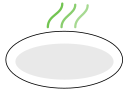

# RootBytes

---

RootBytes is a project inspired by the "Monolith First" pattern, emphasizing simplicity and maintainability in software architecture. The project is designed to evolve into microservices as it grows and requirements change.

## About Monolith First

> "Almost all successful microservice stories started with a monolith that got too big and was broken up."  
> — Martin Fowler

This philosophy encourages starting with a monolithic architecture before considering microservices, ensuring a solid foundation and easier scaling.

---

## References & Further Reading

- [Monolith First by Martin Fowler](https://martinfowler.com/bliki/MonolithFirst.html)
- [Monolith to Microservices](https://www.oreilly.com/videos/monolith-to-microservices/9781663728494/)
- [Modular Monoliths](https://www.youtube.com/watch?v=5OjqD-ow8GE)